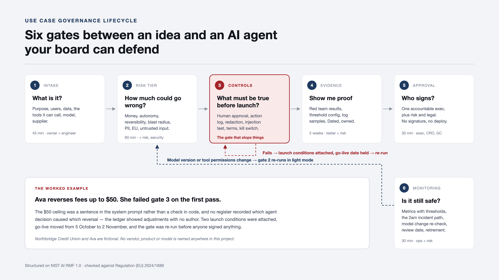

# Use Case Governance Lifecycle

**Six gates between an idea and an AI agent your board can defend.**

A working single-page app that takes one AI agent from intake to approval to monitoring, and produces the artefact that answers the only question a board actually asks:

> "Who approved this, and how do we prove it was safe?"

The worked example is **Ava**, a customer support agent at a fictional credit union. Ava does not pass on the first attempt. The gate she fails is the point of the whole project.

🔗 **[Open the lifecycle](https://example.github.io/ai-governance-lifecycle/)** — walk the Ava record from intake to approval.



---

## Why this exists

Most AI governance material stops at principles. Principles do not tell you whether to launch on Tuesday.

What operating teams actually need is a decision process with a shape: named gates, a tier that scales the effort, a control set that generates itself from the answers, evidence with dates on it, one signature, and something that keeps watching afterwards. That is what this is.

It is built for **agents** specifically — systems that call tools and take actions — rather than for models that return a score. The distinction matters more than most frameworks admit. A model that predicts default risk is a measurement problem. An agent that can reverse a fee is an authority problem, and authority is governed differently.

---

## The scenario

**Northbridge Credit Union** — roughly 400 staff, members in the EU and the US — is launching **Ava**, an LLM support agent in the member chat channel. Ava can:

- answer questions from a knowledge base
- read member account records
- **reverse a fee up to $50**
- open a dispute ticket in the CRM

Four verbs. The third one is why this needed a lifecycle rather than a checklist.

*Northbridge and Ava are fictional. No vendor, product or model is named anywhere in this project — models and suppliers are described by their governance-relevant properties instead, which is how they should be assessed anyway.*

---

## The six gates

Each gate carries a time cost and a list of who has to be in the room, because a governance process that does not budget for people's calendars is a process that gets skipped.

| # | The question asked | What it is | Time | In the room |
|---|---|---|---|---|
| 1 | What is it? | Intake and scoping | 45 min | Product owner, the engineer who built it |
| 2 | How much could go wrong? | Risk tiering | 60 min | Product owner, risk, security |
| 3 | What must be true before launch? | Control requirements | 90 min | Risk, security, legal/DPO, ops |
| 4 | Show me proof | Evidence collection | 2 weeks elapsed | Whoever ran the tests, risk reviewer |
| 5 | Who signs? | Approval record | 30 min | Accountable exec, CRO, GC/DPO |
| 6 | Is it still safe? | Post-deployment monitoring | 30 min, then 30 min quarterly | Ops owner, risk |

The gates are labelled in client language in the app. The formal name sits underneath in smaller type. This is deliberate: the people who have to answer gate 3 are engineers and operations managers, not compliance specialists, and "What must be true before launch?" gets a better answer than "Control requirements attestation".

---

## The no-go moment

This is the part worth reading.

Ava reached gate 3 three weeks before her launch date. Twelve of fourteen required controls were in place — the kill switch had been drilled, the injection testing was done and the findings closed, the supplier terms were reviewed. Two were not:

**Human approval above a money threshold — not in place.**
Fee reversal up to $50 executed with no human in the loop. The $50 ceiling was a sentence in the system prompt, not a check in code. A sufficiently persuasive member, or a sufficiently unusual conversation, was the only thing standing between the agent and a larger number.

**Financial action register — not in place.**
Reversals posted to the core banking ledger, but nothing recorded which agent decision caused them or what reasoning the agent gave. The ledger showed adjustments with no author. Asked how much Ava had given away last quarter, nobody could answer without a manual reconciliation.

Gate 3 did not pass. The launch date was held.

Two ways forward existed: remove the capability, or attach launch conditions that make it defensible. Northbridge attached conditions:

| Condition | Owner | Due |
|---|---|---|
| Threshold moved out of the prompt into service configuration and lowered to $25. Reversals between $25 and $50 queue for member-services approval with a 4-hour SLA. Threshold changes require CRO countersignature. | Head of Member Operations | 20 Oct 2026 |
| Every reversal writes to a separate append-only register the agent credential cannot modify: member ID, amount, policy reason, agent reasoning, approver. Reconciled to the ledger nightly. | Engineering Lead, Member Platforms | 27 Oct 2026 |

Go-live moved from 5 October to 2 November. The gate was re-run, evidence was collected against both conditions, and only then did anyone sign.

**A lifecycle that cannot say no is paperwork.** The value of the six gates is entirely contained in the possibility that one of them stops something — and in the fact that stopping it produced a better system three weeks later rather than an incident six months later.

---

## How the risk tier is decided

Gate 2 asks eight questions, each on a four-point ordinal scale: money at risk, autonomy, reversibility, blast radius, PII sensitivity, EU exposure, untrusted input, and the widest permission the system holds.

The arithmetic gives a starting position. It is not the answer.

On top of it sit **escalation rules** — agent-specific combinations that set a tier floor regardless of the score, each of which states its reasoning in plain English. The one that fired for Ava:

> **Tier 1 floor:** untrusted text reaches a model that holds write access to money. Prompt injection becomes a payments problem, not a content problem.

Others in the set cover irreversible actions, unattended repetition (an agent looping is not one error, it is the same error a thousand times before anyone looks), and financial personal data sharing a context window with attacker-controllable text.

This is where the judgement lives. A pure scoring model would have let Ava through at Tier 2, because most of her individual answers are moderate. It is the *combination* of moderate answers that is dangerous, and combinations are what scoring models are worst at.

The tier then generates the required control set — not from the tier alone, but from the underlying answers. A read-only internal document summariser tiers at Tier 3 and requires two controls; the other twelve are recorded explicitly as *not required at this tier*, so that an omission is a decision rather than an oversight.

---

## The control library

Fourteen controls across six groups, each with a plain-English description and a question to ask in the room. The questions are the useful part — they are written to be answerable, and to be embarrassing if unanswerable.

| Group | Control | The question in the room |
|---|---|---|
| Human oversight | Human approval above a money threshold | What is the number, where is it stored, and who can change it? |
| Traceability | Immutable action log | Can you reconstruct a single member interaction end to end, six months later? |
| Traceability | Financial action register | If the board asks how much the agent gave away last quarter, how long does that take to answer? |
| Containment | Hard tool permission scope | If the prompt were replaced with an empty string, what could it still do? |
| Containment | Prompt injection test before launch | Did anyone try to talk it into a $500 reversal before a member did? |
| Containment | Kill switch, named and tested | Who pressed it in the drill, and how long did it take? |
| Containment | The 2am path | Name the person on call this weekend. |
| Data | PII minimisation before the model call | Pull a raw log line. What is in it? |
| Data | Retention limit and deletion path | Where do transcripts live, and who can delete them? |
| Third party | Supplier terms reviewed and recorded | Which clause says they will not train on this? |
| Third party | Model change control | What happens to this approval when the supplier retires the version you tested? |
| Member-facing | Disclosure and route to a human | Read the first message the member sees. Does it say so? |
| Member-facing | EU documentation pack | Could you hand this over in a week? |
| Monitoring | Sampled human review of answers | What was last week's number? |

Full detail, including the regulatory mapping for each: **[docs/control-library.md](docs/control-library.md)**.

---

## What the EU AI Act actually requires here

Regulatory references sit behind a toggle in the app, off by default, because leading with legal citations is how you lose the room in the first ten minutes.

When you turn the toggle on, the app takes a position that most governance material avoids — and labels it as a position rather than a fact.

> **This is exclusively my own governance evaluation, not legal advice.** A real deployment would need counsel to confirm or reject it in writing before launch, and in this lifecycle that written legal position is itself a control — a dated artefact at gate 4 with a named owner. Where my reading and counsel's differ, counsel's governs.

**My working position is that Ava likely falls outside Annex III.** She answers questions, reverses small fees against existing policy, and opens tickets, rather than evaluating creditworthiness or scoring members, which is what Annex III 5(b) captures. I hold that with moderate rather than high confidence; the point that would test it is whether a fee waiver that varies between members affects access to a service in substance, whatever the policy says on paper.

The reason for taking a position at all: claiming high-risk status where it may not apply is not free conservatism. It burns credibility with the business and risks burying the obligations that genuinely do bite.

What appears to apply regardless:

- **Article 50(1)** — transparency. Ava interacts directly with natural persons and must be designed so members know they are dealing with an AI system. In application since 2 August 2026.
- **Article 4** — AI literacy for the staff who supervise her.
- **Article 25** — if Northbridge brands the system as its own in a way that makes it a provider rather than a deployer, the obligation set changes.
- **GDPR** throughout, which is doing most of the real work in this use case.

And the line to watch: **if Ava is ever extended to influence lending decisions, Annex III 5(b) engages on any reading** and everything changes — conformity assessment, Article 11 technical documentation, Article 14 human oversight, registration. That is a re-tier, not a feature release, and it is written into the model change control for exactly that reason.

NIST AI RMF is used as the structure rather than the authority. It is voluntary, and its four functions map onto what a credit union board already understands: govern, map, measure, manage.

More: **[docs/regulatory-notes.md](docs/regulatory-notes.md)**.

---

## Design decisions

**One accountable executive, not a committee.** A committee cannot be held to account. When something goes wrong, the honest answer to "who decided this" becomes "the room". The approval record names a single person who carries the outcome, with risk and legal recorded as having reviewed rather than as co-owners. Harder conversation at the time, much easier one afterwards.

**Signatures are locked while any required control is unmet.** An executive should never be asked to sign against an incomplete control set, because the signature is the mechanism that transfers accountability to them.

**Model change control is a first-class gate, not a footnote.** The most common way an approved AI system becomes an unapproved one is that the supplier moved the version — or someone changed what it's allowed to do — and nobody told governance. The app includes a working simulation, not a scripted one: it snapshots the tier and required controls at the moment of the trigger, then genuinely recomputes both when the re-check runs. If nothing in gate 2's answers actually changed, it says so truthfully; if they did, it shows the real diff and escalates rather than quietly passing.

**Prohibited practice is screened before risk is tiered, not folded into it.** Gate 1 checks for EU AI Act Article 5(1)(a) through (bb) — manipulation, exploiting a vulnerability, non-consensual intimate imagery, CSAM generation, social scoring, predictive policing, and the rest — ahead of the eight risk-tiering questions at gate 2. Two of the ten ((ba)/(bb)) were added by a July 2026 amendment and apply from 2 December 2026; included ahead of that date on purpose, since a screen that only checks what's already binding misses what's confirmed and imminent. A "yes" is not a higher tier; it is a hard stop that blocks approval regardless of what controls gate 3 could produce, because no control set makes a prohibited practice approvable. Ava clears all ten, which is the ordinary outcome — the value of the screen is in the rare case that doesn't.

**The risk score is weighted and the cutoffs are named, not arbitrary.** The eight gate-2 questions don't count equally — each carries a stated weight and a one-sentence reason why, the same discipline already applied to the escalation rules. The tier cutoffs are expressed as named severity bands (Tier 1 begins at a weighted-average High, Tier 3 requires staying under Moderate) rather than an unexplained fraction of a maximum score.

**The decision log is treated as append-only and is the real deliverable.** The approval record exports as Markdown with the full decision history, including the failure. A governance record that shows only successes is not evidence of governance. "Append-only" here describes the intended workflow, not a technical guarantee — see Known limitations below for what that distinction actually means.

**Time costs are stated on every gate.** A process that does not budget for calendars gets skipped, and a skipped process is worse than no process because it creates the appearance of control.

### Deliberately out of scope

No dashboards, no multi-user workflow, no comment threads, no approval routing engine. Those are product features, and adding them would have obscured the thing being demonstrated, which is the decision structure. Six gates and an approval record.

### Known limitations

This app runs entirely inside your browser — no server, no login system, no file storage. That single fact is the root cause of everything below; each gap traces back to there being no independent, outside system keeping watch, only the same browser the visitor controls.

**The decision log isn't actually tamper-proof.** It's called "append-only" throughout this project, and the interface treats it that way, but that describes the intended workflow, not a technical guarantee. It's a list stored in the visitor's own browser — anyone comfortable with developer tools could rewrite it, and nothing here would show that it happened. A real tamper-evident log needs a server (or something like a hash chain) recording events independently of the person the log is about. Verifying someone's own claims using only their own notebook doesn't work, no matter how neatly the notebook is organised.

**Signing is a name typed into a box, not a verified identity.** Nothing checks that "M. Okonjo" was actually typed by M. Okonjo. Real identity verification — a login, a company email confirmation, a proper e-signature service — needs user accounts and a server to check credentials against: a different, much bigger piece of software than a single page that runs offline.

**Evidence is a description, not the document itself.** Gate 4 records "Adversarial test report — 47 attempts, 3 findings" with a date and an owner, but no PDF, screenshot, or file is actually attached or checked. That's the difference between a filing cabinet holding the real signed reports and an index card that says a report exists somewhere. The index card is what a page with no file storage can offer; the filing cabinet needs a server.

**Nothing checks that different signers are actually different people.** Catching "the same person signed twice under two names" requires knowing who is really behind the keyboard, which loops back to the identity problem above. Without that, the software can only compare the text people typed, not the people themselves.

None of these get a fake fix. A padlock icon that doesn't lock anything, or a "verified" checkmark that verifies nothing, would look more secure than this actually is — which is worse than the honest gap. Closing any of them for real means adding the one thing this project deliberately doesn't have: a server.

---

## Running it

No build step, no dependencies, no network calls. State persists to `localStorage`.

```bash
python3 -m http.server 4173
```

Then open `http://localhost:4173`.

### Deep links

| URL | What it opens |
|---|---|
| `?record=firstpass#gate-3` | The Ava record at the moment gate 3 failed |
| `?record=approved#gate-5` | The completed record, signed |
| `?regs=1` | Regulatory references toggled on |
| `#gate-4` | Any gate directly |

### Regenerating the images

`tools/make-assets.sh` drives headless Chrome over the running app to rebuild the diagram and the nine summary cards into `media/`. The screenshots are captured from the app itself, so they cannot drift from what it actually does.

```bash
./tools/make-assets.sh
```

---

## Repository

```
index.html                     the app
assets/data.js                 gates, risk questions, control library, the Ava record
assets/app.js                  risk engine, gate logic, approval record
assets/styles.css              light and dark
assets/lifecycle-diagram.svg   the six-gate diagram
docs/control-library.md        all fourteen controls with framework mapping
docs/regulatory-notes.md       the EU AI Act classification reasoning
media/                         diagram PNG, summary cards
tools/                         asset generation
```

---

## Authorship

The governance design is mine — the gate structure, the risk questions and escalation rules, the control library, the tiering logic, and the decision to make the worked example fail.

Northbridge Credit Union, Ava, and every name in the approval record are fictional. Any resemblance to a real institution is coincidental.
